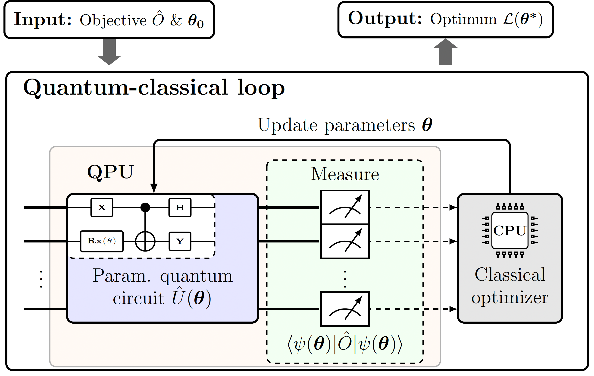

# Optimizing Variational Quantum Algorithms with qBANG: A Hybrid Approach to Tackle Flat Energy Landscapes

This repo contains the code for the optimizers introduced in the paper "Optimizing Variational Quantum Algorithms with qBANG: A Hybrid Approach to Tackle Flat Energy Landscapes" [[arXiv](UPDATE LINK)].


## Installation and use

To use this code, you will need to set up a conda environment with Python 3.10. You can do this by running the following command:
setup conda environment 

```
conda create --name ENV_NAME python=3.10  
conda activate ENV_NAME
```

The package `qbang` is prepared such that it can be installed in development mode locally (such that any change in the code is instantly reflected). To install `qbang` locally, clone/download the repository and run the following command from the `qbang` folder:

```
pip install -e .
```

Feel free to reach out to me at dpfitzek@gmail.com if you face any issues.


## Usage 
To get started check out the `examples/qBang_tutorial.ipynb` notebook.


## Contributing
We welcome contributions to this project! If you'd like to contribute, please submit a pull request with your changes. If you have any questions or suggestions, please feel free to contact us at dpfitzek@gmail.com.

## Testing and verification

For testing and verification of the software run:

```
pytest src/qbang/tests
```


## Background

Variational quantum algorithms (VQAs) are a promising approach for solving complex optimization problems using quantum computers. However, these algorithms can struggle when faced with flat energy landscapes, where many parameter settings result in similar objective function values. qBang addresses this challenge by using a hybrid approach that combines classical optimization techniques with quantum information methods. By approximating the quantum Fisher information matrix, qBang is able to identify promising regions of the search space more efficiently than other optimizers.

The figure included in the readme file shows the workflow of the VQA with qBANG, highlighting the use of the optimizer.




## Acknowledgements

We found several very helpful codebases when building this repo, and we sincerely thank their authors:

+ PennyLane Tutorials:
    + [Alleviating barren plateaus with local cost functions](https://pennylane.ai/qml/demos/tutorial_local_cost_functions.html)
    + [Quantum natural gradient](https://pennylane.ai/qml/demos/tutorial_quantum_natural_gradient.html)
    + [Barren plateaus in quantum neural networks](https://pennylane.ai/qml/demos/tutorial_barren_plateaus.html)


## Citation

If you find this repo useful for your research, please consider citing our paper:

```bibtex
@article{opt-vqa-with-qbang,
  title={Optimizing Variational Quantum Algorithms with qBANG: A Hybrid Approach to Tackle Flat Energy Landscapes},
  author={Fitzek, David and Jonsson, Robert S. and Dobrautz, Werner and Schäfer, Christian},
  journal={arXiv preprint arXiv:XXXX.XXXX},
  year={2023},
}
```

## Version History

Initial release (v1.0): April 2023

## Team

Current maintainers:

+ [David Fitzek](https://www.linkedin.com/in/david-fitzek-1851b1162/) ([@therealdavidos](https://twitter.com/therealdavidos),
  davidfi@chalmers.se),

## License

MIT License
